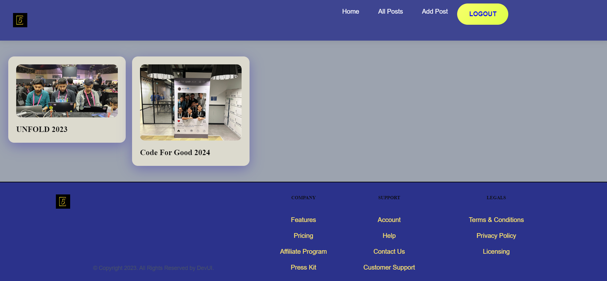

# 🚀 Echowrite – A Personal Blogging Platform

Welcome to **Echowrite**, a custom-built blogging platform where I document my journey as a software developer. From showcasing personal projects and achievements to writing about cutting-edge tech trends, Echowrite is a platform for dynamic content creation and an opportunity to demonstrate my full-stack development skills.

Explore **Echowrite** to see how I blend **user-centric design** with **robust technology** to create impactful solutions.




---

## 🌟 Highlights
- **🚀 Built From Scratch**: Full-stack web application created using modern web development tools like React and Appwrite.
- **🖋️ Tech Blogs & Projects**: A dedicated platform to showcase technical articles, project details, and career milestones.
- **🔍 SEO Optimized**: Enhanced discoverability with SEO best practices for wider reach.
- **💻 Responsive Design**: Seamlessly performs across desktops, tablets, and mobile devices.
- **🔐 Secure Authentication**: Implements Appwrite user authentication for secure access and data privacy.

---

## 🎯 Purpose & Vision

### **Why Echowrite?**
**Echowrite** serves as a personal journal of my growth as a developer, where I share insights into complex technologies and the challenges faced while building real-world applications. This platform is designed to provide value to fellow developers, tech enthusiasts, and recruiters alike.

---

## 🛠️ Technologies Behind Echowrite

This project combines cutting-edge technologies to ensure a smooth, scalable, and secure experience:

- **Frontend**: React.js, Tailwind CSS
- **Backend**: Appwrite (Backend as a Service)
- **Hosting**: Deployed on Vercel for fast, reliable performance

### **Why These Tools?**
I chose **React** for its component-based architecture, allowing me to build reusable, dynamic UIs. **Tailwind CSS** offers a flexible, utility-first approach to styling, which helps me maintain clean, responsive layouts with minimal CSS overhead. **Appwrite** takes care of user authentication and database operations, allowing me to focus on frontend development while providing a secure backend.

---

## ⚙️ Core Features

- **📝 Rich Text Blog Editor**: Easily create and format articles using a custom-built rich text editor.
- **📁 Categorized Content**: Navigate through different categories such as *Projects*, *Achievements*, and *Tech Articles*.
- **🔑 Secure User Authentication**: Ensures that all user interactions are safe and secure.
- **📱 Mobile-First Design**: Optimized for fluid and responsive user experience across all devices.
  

---

## 🚀 Quickstart Guide

Want to try **Echowrite** locally? Here's how to set it up:

1. **Clone the repository**:
    ```bash
    git clone https://github.com/BishwayanDebRoy/Echowrite.git
    ```

2. **Navigate to the project directory**:
    ```bash
    cd Echowrite
    ```

3. **Install dependencies**:
    ```bash
    npm install
    ```

4. **Set up environment variables**:
   Create a `.env` file in the root directory and configure your Appwrite project:
   ```bash
  
   VITE_APP_APPWRITE_URL=<Your APPWRITE URL>
   VITE_APPWRITE_PROJECT_ID=<Your PROJECT ID>
   VITE_APPWRITE_DATABASE_ID=<Your DATABASE ID>
   VITE_APPWRITE_COLLECTION_ID=<Your COLLECTION ID>
   VITE_APPWRITE_BUCKET_ID=<Your BUCKET/STORAGE ID>

5. **Start the development server**:
   ```bash
   npm run dev

6. Open your browser and visit http://localhost:5173 to view the app.

## 🌐 Live Demo
Curious to explore Echowrite? Check out the live version: [Echowrite](https://echowrite-blogapp.vercel.app).


## 💡 What Makes Echowrite Unique?
Echowrite is more than just a blogging platform—it’s a demonstration of my ability to:
- Design and develop full-stack applications using modern tools and techniques.
- Build scalable, secure, and responsive web applications that solve real-world problems.
- Work independently from concept to deployment, effectively managing the entire development lifecycle.

## 🌱 Future Roadmap

Here's what I plan to add to **Echowrite**:

- **🗨️ Comment System**: Enable readers to leave feedback on blog posts.
- **🔍 Search & Filter**: Quickly find blog posts by keywords and tags.
- **📊 Analytics Dashboard**: Track readership and engagement for each post.
- **🧑‍🤝‍🧑 User Profiles**: Allow users to create profiles and manage their published content.
- **📧 Subscription Feature**: Notify users when new content is published.

These enhancements will further showcase my **problem-solving skills** and **ability to iterate on feedback**.

---

## 🤝 How to Contribute

I believe in collaboration and continuous improvement. If you have ideas to make **Echowrite** better or spot any issues, feel free to contribute:

1. **Fork the repository**.
2. **Create a new branch** (`git checkout -b feature/YourFeature`).
3. **Commit your changes** (`git commit -m 'Add a feature'`).
4. **Push to the branch** (`git push origin feature/YourFeature`).
5. **Open a Pull Request**.


## 📝 License
This project is licensed under the MIT License. For more information, please refer to the [LICENSE](LICENSE.txt) file.

---

## 📞 Get In Touch!

I’m always open to feedback, collaboration, and new opportunities. Feel free to reach out:

- **Email**: [bishwayandebroy11@gmail.com](mailto:bishwayandebroy11@gmail.com)
- **GitHub**: [BishwayanDebRoy](https://github.com/BishwayanDebRoy)
- **LinkedIn**: [Bishwayan Deb Roy](https://www.linkedin.com/in/bishwayandebroy11)

---
Made with ❤️ by [Bishwayan Deb Roy](https://github.com/BishwayanDebRoy)
